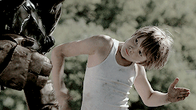

+++

title = "Brainstorming + Inspiration"

weight = 20

+++

The idea to create a shadow boxing robot was nearly instant on the first team brainstorming night. Our  learning goals imposed an intense set of requirements on the project:

- *Machine Learning* - Use AI/ML to provide a powerful HCI experience
- *Mechanical Iteration*: Fabricate several iterations of a hardware-focused project
- *Kinematics* - Do some complicated parallel math to build concurrency skills
- *Firmware* - Use higher-end embedded architectures ARM/STM32
- *Closed-loop control* - Implement a predictive control algorithm
- *Project Management* - Get things done on time!

We ideated in one night, coming up with a handful of different projects we thought might properly satisfy the design constraints (notice the 5th idea):

{{ resize_image(path="documentation/overview/brainstorming/untitled.png", width=0, height=500, op="fit_height") }}

## Night 1 Ideation

We initially imagined the shadow boxing robot as a pair of fighters - similar to the rock-em-sock robot game. Ultimately, we settled on a single fighter with a similar range of motion to that of the robots in the movie "Real Steel" - the 2011 action flick of the summer with Hugh Jackman and Dakota Goyo - one of our all-time personal favorite movies.

